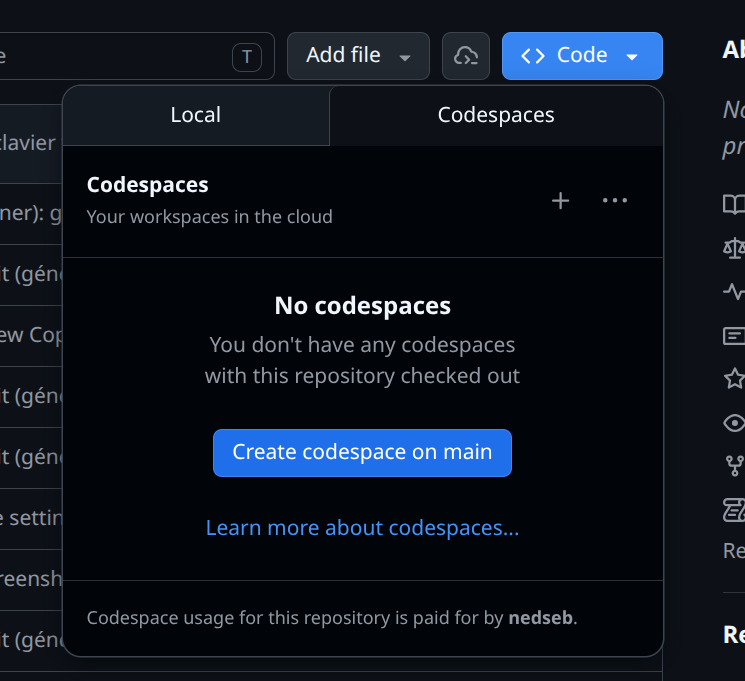
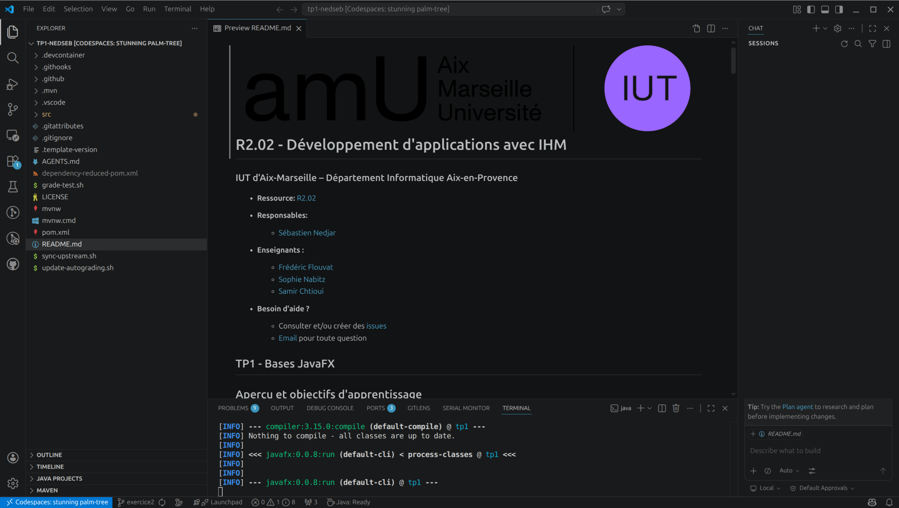
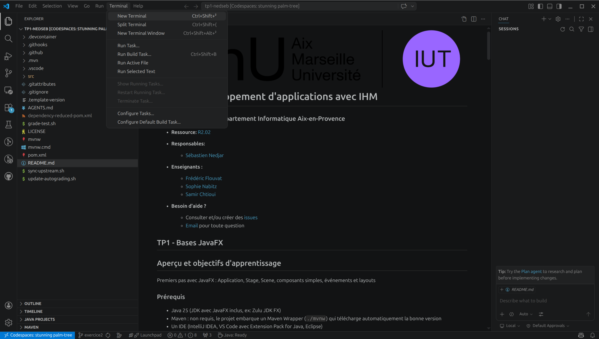

#  R2.03 - Qualité de développement

### IUT d'Aix-Marseille - Département Informatique Aix-en-Provence

- **Ressource :** [Syllabus R2.03](https://github.com/IUTInfoAix-R203/syllabus) (compétences, calendrier, évaluations, ressources détaillées)

- **Équipe pédagogique :**

  - [Sébastien Nedjar](mailto:sebastien.nedjar@univ-amu.fr) - responsable du module
  - [Sophie Nabitz](mailto:sophie.nabitz@univ-avignon.fr)
  - [Leïla Sakli Miled](mailto:leila.SAKLI@univ-amu.fr)

- **Besoin d'aide ?**
    - Consulter et/ou créer des [issues](https://github.com/IUTInfoAix-R203/tp4/issues)
    - [Email](mailto:sebastien.nedjar@univ-amu.fr) pour toute question


## TP4 - Refactoring : transformer sans casser

## Objectifs de la séance

### Ce que vous saurez faire à la fin de cette séance

Les exercices de ce TP sont organisés en progression. Cette progression suit la **taxonomie de Bloom**, un modèle pédagogique qui décrit les niveaux de maîtrise d'un savoir-faire -du plus simple (comprendre un concept) au plus complexe (créer une application complète).

| Niveau Bloom | Exercices | Vous serez capable de... | Compétence BUT |
|---|---|---|---|
| **Comprendre** | 1 et 2 | Identifier les <b>code smells</b> classiques (Long Method, Magic Number, Switch Statement, Long Parameter List) et nommer le refactoring qui les corrige | AC11.02 |
| **Appliquer** | 1, 2 et 3 | Appliquer <b>Replace Magic Number</b>, <b>Extract Method</b>, <b>Replace Conditional with Polymorphism</b> et <b>Introduce Parameter Object</b> en gardant les tests verts à chaque étape | AC11.02, AC11.03 |
| **Analyser / Créer** | 4 | Refactorer fearlessly un code legacy réel (Gilded Rose) en s'appuyant sur une couverture de tests de caractérisation que vous aurez complétée | AC11.02, AC11.03 |

**Tout au long du TP** vous développez un réflexe professionnel essentiel : <b>ne pas casser ce qui marche</b>. La discipline "rouge = je ne commit pas, vert = je commit souvent" vous suit partout.

### Pourquoi cette démarche ?

**Refactorer, c'est transformer du code sans changer son comportement.** Ce n'est pas "ajouter une fonctionnalité", ce n'est pas "corriger un bug" : c'est améliorer la <b>lisibilité</b>, la <b>maintenabilité</b>, la <b>structure</b> d'un code qui fonctionne déjà. Martin Fowler a codifié ce geste professionnel dans son livre <em>Refactoring</em> (1999, 2e éd. 2018) : il y catalogue <b>30+ refactorings</b> de base, chacun étant une transformation déterministe qui préserve le comportement.

Pour refactorer en sécurité, il faut un <b>filet de tests</b>. C'est exactement ce que vous apportent les <em>tests de caractérisation</em> : des tests qui décrivent le comportement actuel du code (qu'il soit "juste" ou non), et qui vous alertent dès qu'un refactoring l'a modifié par accident. Une bonne couverture de tests, c'est la différence entre un refactoring et un bug.

Dans ce TP, chaque exercice vous donne :

1. Un <b>code smelly</b> mais fonctionnel
2. Une <b>suite de tests de caractérisation</b> (active, verte) qui pin le comportement
3. Un ou plusieurs <b>tests de structure</b> (désactivés) qui valident que vous avez bien appliqué le bon refactoring

Votre mission : appliquer le(s) refactoring(s) demandés dans le README <b>en gardant tous les tests verts</b>. Les tests de structure s'activent au fur et à mesure pour valider que vous avez bien extrait les bonnes méthodes, les bonnes constantes, les bonnes classes.

> [!TIP]
> La règle d'or du refactoring : <b>un petit pas, un test, un commit</b>. Ne faites jamais 10 transformations en même temps ; vous perdrez le fil et un bug se glissera. Faites-en une, vérifiez que tout est vert, commitez, puis seulement passez à la suivante.

Copilot Chat reste votre <b>tuteur</b> pour ce TP : il vous aidera à identifier les smells, vous suggérera le refactoring approprié, et vous guidera étape par étape sans vous donner directement le code refactoré.

### Lien avec la suite du module et la SAE

Ce TP est le dernier contact pédagogique avant l'examen **CC3** (mini-kata TDD sur feuille, 2 h, commun avec R2.02). Les trois semaines qui vous séparent de l'examen sont occupées par la **SAE 2.01** (développement d'une application).

Dans la SAE, vous allez régulièrement devoir :
- **Ajouter une fonctionnalité** dans du code qu'un coéquipier a écrit - pas toujours propre
- **Corriger un bug** dans ce code - sans casser le reste
- **Nettoyer** quand la date limite le permet

C'est exactement ce que ce TP vous apprend à faire en sécurité. Le jour de l'examen, vous saurez pourquoi tel test doit être écrit avant tel autre, pourquoi une méthode extraite vaut mieux qu'un commentaire.

### Prérequis

#### Connaissances attendues

- **Programmation orientée objet en Java** : classes, héritage, classes abstraites, polymorphisme (R2.01) - le TP4 utilise beaucoup l'héritage
- **Collections Java** : `List`, `Map`, `Comparator` (R2.01)
- **Git avancé** : branche par exercice, Pull Request, review, Conventional Commits (TP1)
- **Cycle TDD** : RED-GREEN-REFACTOR, baby steps (TP2 et TP3)

#### Environnement technique

L'ensemble du TP se fait sur **GitHub Codespaces** -aucune installation locale n'est nécessaire. L'environnement (Java 25, Maven, Git, Copilot Chat) est pré-configuré et prêt à l'emploi dès l'ouverture du Codespace.

> Pour une installation locale (facultative), voir la section [Dépannage](#dépannage) en fin de document.

### Documentation de référence

- [Java 25 API Documentation](https://docs.oracle.com/en/java/javase/25/docs/api/)
- [JUnit 5 User Guide](https://junit.org/junit5/docs/current/user-guide/)
- [AssertJ Core Documentation](https://assertj.github.io/doc/)
- [ApprovalTests Java](https://github.com/approvals/ApprovalTests.Java)

---

## Mise en place

La mise en place se fait en deux étapes : accepter le devoir sur GitHub Classroom (qui crée votre dépôt personnel), puis ouvrir ce dépôt dans un Codespace (votre environnement de développement dans le navigateur).

### Étape 1 - Accepter le devoir sur GitHub Classroom

1. Cliquez sur le lien suivant :

   👉 **https://classroom.github.com/a/ApDTiHdo**

2. Si c'est votre première utilisation de GitHub Classroom, autorisez l'accès à votre compte GitHub.
3. Sélectionnez votre nom dans la liste des étudiants (si elle apparaît) pour associer votre compte GitHub à votre identité dans le cours.
4. Cliquez sur **"Accept this assignment"**.
5. Attendez quelques secondes - GitHub crée automatiquement un dépôt à votre nom : `IUTInfoAix-R203-2026/tp4-votreLogin`.
6. Cliquez sur le lien du dépôt créé pour y accéder.

### Étape 2 - Ouvrir le projet dans GitHub Codespaces

Une fois sur la page de votre dépôt :

1. Cliquez sur le bouton vert **"Code"** (en haut à droite du listing de fichiers).
2. Sélectionnez l'onglet **"Codespaces"**.
3. Cliquez sur **"Create codespace on main"**.

 Codespaces -> Create codespace on main" width="400"/>

4. Attendez que l'environnement se construise (de 1 à 5 minutes la première fois).
5. VS Code s'ouvre **dans votre navigateur** avec tout l'environnement pré-configuré :
   - Java 25
   - Maven (via le wrapper `./mvnw`)
   - Git
   - Copilot Chat (votre assistant IA pédagogique)
   - Toutes les extensions nécessaires



> [!IMPORTANT]
> Le Codespace est **personnel et persistant**. Quand vous fermez l'onglet, votre travail est sauvegardé. Pour reprendre, retournez sur votre dépôt GitHub -> **"Code"** -> **"Codespaces"** -> cliquez sur le Codespace existant (ne créez pas un nouveau à chaque fois).

### Vérification rapide

Une fois le Codespace ouvert, ouvrez un terminal via le menu **Terminal -> New Terminal** :



Puis lancez :

```bash
./mvnw test
```

Vous devriez voir un résultat du type :
```
Tests run: X, Failures: 0, Errors: 0, Skipped: X
BUILD SUCCESS
```

Si c'est le cas, tout est prêt. Le seul test actif (`AppTest`) passe, et les tests d'exercices sont en attente (`Skipped`) - c'est normal, ils seront activés au fil de votre progression.

---

## Rendu du travail et évaluation

### Comment vous êtes évalués

L'évaluation de ce TP est **entièrement automatique** : à chaque fois que vous poussez (`push`) votre code sur GitHub, un système d'autograding exécute tous vos tests et calcule un score sur **1000 points**. Ce score est affiché tel quel par le reporter Classroom ; pour le ramener à la note sur 20, divisez par 50 (ex : 850/1000 = 17/20).

- **100 points** sont attribués si le projet **compile** correctement
- **900 points** sont répartis entre les différents **tests des exercices**, chaque test valant au moins 1 point
- Un test `@Disabled` (non encore activé) rapporte **0 point** - c'est normal
- Un test activé et **qui passe** rapporte ses points
- Un test activé et **qui échoue** rapporte 0 point

Votre score augmente progressivement au fil de votre avancement. Il n'y a pas de date limite brutale : chaque push met à jour votre score.

### Consulter votre note actuelle

Après chaque `push`, rendez-vous sur la page de votre dépôt GitHub -> onglet **"Actions"** -> dernier run du workflow **"GitHub Classroom Workflow"**. Le score apparaît dans le résumé :

```
Points 250/1000
```

Vous pouvez aussi voir le détail test par test pour savoir exactement quels exercices sont validés et lesquels restent à faire.

---

## Commandes essentielles

**Maven** est un outil de construction de projets Java utilisé dans la majorité des projets professionnels. Il gère automatiquement la compilation du code, le téléchargement des bibliothèques nécessaires (JUnit, AssertJ, Mockito, ApprovalTests...), l'exécution des tests et le packaging de l'application. Plutôt que de lancer `javac` et `java` à la main avec des dizaines d'options, une seule commande Maven suffit.

Dans ce projet, Maven est embarqué via un **Maven Wrapper** (`./mvnw`) : un script qui télécharge et utilise automatiquement la bonne version de Maven. Aucune installation n'est nécessaire : la première exécution prend quelques secondes de plus (téléchargement), puis tout est instantané.

| Commande | Effet |
|----------|-------|
| `./mvnw compile exec:java` | Lance le menu console de l'application (choisit un exercice) |
| `./mvnw test` | Exécute les tests unitaires |
| `./mvnw clean test` | Rebuild propre (supprime `target/` puis relance les tests) |
| `./mvnw clean` | Supprime les artefacts (`target/`) |
| `./mvnw spotless:apply` | Formate le code Java (Google Java Style) |

> [!NOTE]
> Le code est aussi formaté **automatiquement** avant chaque commit via un hook pre-commit invisible. Il n'est pas nécessaire de lancer `spotless:apply` à la main, sauf pour vérifier visuellement le formatage avant un commit.

---

## Workflow de développement

Chaque exercice suit le même cycle. Cette démarche structurée vous aide à travailler de manière **méthodique et professionnelle** : c'est exactement le workflow que vous utiliserez en entreprise.

**1. Créer une branche pour l'exercice**

```bash
git checkout -b exerciceN
```

**2. Activer le premier test** - ouvrez le fichier de test correspondant et retirez l'annotation `@Disabled` du premier test.

**3. Vérifier que le test est rouge**

```bash
./mvnw test
```

Le test doit échouer - c'est normal et attendu. Le message d'erreur vous indique ce que le test attend.

**4. Implémenter le minimum** pour faire passer ce test au vert. Pas plus que nécessaire.

**5. Vérifier que le test passe**

```bash
./mvnw test
```

**6. Lancer l'application** pour voir le résultat depuis le menu :

```bash
./mvnw compile exec:java
```

Ou via `Ctrl+Shift+B` dans VS Code.

**7. Recommencer** - activez le test suivant (étapes 2 à 6) jusqu'à ce que tous les tests de l'exercice soient verts.

**8. Finaliser l'exercice** - quand tous les tests passent :

```bash
git add .
git commit -m "feat(exerciceN): termine l'exercice"
git push -u origin exerciceN
```

**9. Créer une Pull Request** pour voir votre travail et recevoir une review automatique :

```bash
gh pr create --title "feat(exerciceN): termine l'exercice" --body "Tous les tests passent."
```

Ouvrez la PR dans le navigateur (`gh pr view --web`) pour consulter le diff, les checks CI, le score autograding et les commentaires de la review Copilot.

**10. Merger et passer à la suite** :

```bash
gh pr merge --rebase --delete-branch
```

Cette commande merge la PR, bascule votre HEAD local sur `main`, `pull` les
derniers commits et supprime la branche de feature locale et distante.

Votre score sur GitHub Actions augmente à chaque exercice terminé. Vous pouvez maintenant passer à l'exercice suivant en reprenant à l'étape 1.

> [!TIP]
> **Copilot Chat** est là pour vous accompagner à chaque étape. N'hésitez pas à lui poser des questions - il vous guidera sans donner la solution directement.

---

## Assistance IA

Vous avez le droit d'utiliser **Copilot Chat** (panneau latéral dans VS Code) quand vous bloquez sur un exercice. Il est configuré spécifiquement pour ce TP : il ne donnera pas la solution directement, mais vous guidera par étapes : d'abord une explication du concept, puis un pointeur vers la documentation, et seulement en dernier recours un minimum de code.

**Copilot Chat n'est pas un raccourci, c'est un tuteur.** Il vous aide à comprendre, pas à copier-coller. L'objectif est que vous soyez capable d'écrire ce code **seul(e)** à la fin de la séance.

**Pourquoi c'est important** : l'évaluation de ce module se fera **sur papier, sans aucun outil d'assistance**. Il est donc essentiel que vous construisiez vos automatismes en écrivant le code vous-même. Copilot Chat est un filet de sécurité pour débloquer, pas un substitut à la réflexion.

**Conseil pratique** : sur les premiers exercices, n'hésitez pas à demander de l'aide pour vous familiariser avec les concepts et le workflow. Sur les exercices avancés, essayez d'aller le plus loin possible par vous-même avant de solliciter l'assistant. C'est cette progression vers l'autonomie qui vous préparera le mieux aux évaluations.

Le TP est découpé en plusieurs **exercices** à faire dans l'ordre. Chaque exercice vit dans son propre sous-paquet (code et tests en miroir). L'exercice 1 est très guidé pas à pas pour vous familiariser avec l'environnement. À partir de l'exercice 2, une boucle de travail systématique est introduite que vous appliquerez pour tous les exercices suivants.

---

## Protocole de refactoring à appliquer à chaque exercice

1. **Lire le code** en entier, sans toucher. Identifier les smells à l'œil.
2. **Lancer les tests** (`./mvnw test -Dtest='MonTest'`). Ils doivent tous être verts - c'est votre filet de sécurité.
3. **Créer une branche** : `git checkout -b exoN-refactoring`.
4. **Appliquer un refactoring à la fois**. Après chaque : relancer les tests. Si vert, commit. Si rouge, reculer et comprendre.
5. **Activer les tests de structure** un par un, au fur et à mesure de vos transformations. Ils s'activent en retirant `@Disabled`.
6. Quand tous les tests sont verts : **pousser et ouvrir une PR**.

> [!IMPORTANT]
> **Ne désactivez jamais un test de caractérisation**. Si un test de caractérisation casse pendant votre refactoring, c'est que vous avez changé le comportement - par définition, ce n'est plus un refactoring, c'est un bug. Annulez votre dernière modification et comprenez ce qui s'est passé.

---

## Exercice 1 - Facture (★★) - Long Method + Magic Numbers

### Smells à corriger

Ouvrez `Facture.java` et observez. Vous verrez :

- **Long Method** : `calculerTotal()` fait trois choses (somme HT, TVA, remise) en une méthode de 10 lignes. Les commentaires décrivent chaque étape - c'est un bon signe que chaque étape mérite son propre nom de méthode.
- **Magic Number** : les valeurs `1.20`, `100`, `0.9` sont codées en dur. Elles sont expliquées par les commentaires, mais un commentaire est une documentation qui <em>ne sera pas</em> relue systématiquement.

### Refactorings à appliquer

1. **Replace Magic Number with Symbolic Constant** : extraire trois `private static final double` avec des noms parlants (`TAUX_TVA`, `SEUIL_REMISE`, `TAUX_REMISE`).
2. **Extract Method** : extraire trois méthodes privées `sommeHT`, `appliquerTVA`, `appliquerRemise`. Après refactoring, `calculerTotal` doit se réduire à une composition de trois appels.

### Tests (5 caractérisation + 5 structure)

Les 5 tests de caractérisation sont actifs dès le début - ils passent sur le code smelly et doivent rester verts. Les 5 tests de structure sont `@Disabled` ; activez-les au fur et à mesure :

1. `constantesSymboliquesExtraites` - après l'extraction des constantes
2. `methodeSommeHTExtraite` - après la première extraction de méthode
3. `methodeAppliquerTVAExtraite` - après la deuxième extraction
4. `methodeAppliquerRemiseExtraite` - après la troisième extraction
5. `methodeCalculerTotalCourte` - quand `calculerTotal` est réduit à sa composition finale

---

## Exercice 2 - Animal (★★★) - Replace Conditional with Polymorphism

### Smells à corriger

`Animal.faireDuBruit()` est un gros `switch` sur un champ `type:String`. C'est le **Type Code** classique : un champ qui encode la nature de l'objet, exploité par des `switch` éparpillés dans le code. Chaque nouvelle espèce impose de toucher ce switch ; chaque oubli est un bug silencieux.

### Refactoring à appliquer

**Replace Conditional with Polymorphism**. Transformer `Animal` en classe abstraite. Créer `Chien`, `Chat`, `Vache`, `Canard` qui héritent de `Animal` et redéfinissent `faireDuBruit()`. Le `switch` disparaît, remplacé par le dispatch JVM.

Pour conserver la compatibilité avec les appelants existants qui font `new Animal("Rex", "chien")`, introduisez une méthode statique de fabrique : `Animal.creer(String type, String nom)` qui retourne la bonne sous-classe.

### Tests (5 caractérisation + 5 structure)

Structure à activer progressivement :

1. `animalEstAbstract` - après avoir rendu `Animal` abstract
2. `classeChienHeriteDAnimal` - après avoir créé `Chien`
3. `toutesLesEspecesOntLeurClasse` - après avoir créé `Chat`, `Vache`, `Canard`
4. `champTypeStringSupprime` - après avoir retiré le champ `type:String` d'Animal
5. `fabriqueCreeLaBonneEspece` - après avoir ajouté la méthode statique `Animal.creer(...)`

---

## Exercice 3 - ServiceNotification (★★) - Introduce Parameter Object

### Smell à corriger

`ServiceNotification.envoyer(String, String, String, String, boolean, int, String[])` a **7 paramètres**. L'appel est illisible (on ne sait pas ce que vaut le `boolean`), et ajouter un 8e paramètre (ex: `replyTo`) imposerait de modifier tous les appelants. Les 7 paramètres forment un groupe cohérent : ils décrivent un même <em>message email</em>.

### Refactoring à appliquer

**Introduce Parameter Object**. Créer un record `MessageEmail(String destinataire, String expediteur, String sujet, String corps, boolean important, int priorite, String[] piecesJointes)`. Créer une nouvelle méthode `envoyer(MessageEmail message)` qui délègue à l'ancienne (pour conserver la compatibilité, temporairement). Une fois la nouvelle méthode utilisée partout, on peut supprimer l'ancienne.

### Tests (4 caractérisation + 4 structure)

Structure à activer progressivement :

1. `messageEmailEstUnRecord` - après avoir créé la classe `MessageEmail` comme record
2. `messageEmailA7Composants` - après avoir ajouté les 7 composants (destinataire, expéditeur, sujet, corps, important, priorité, piècesJointes)
3. `nouvelleSignatureAvecMessageEmail` - après avoir créé la méthode `envoyer(MessageEmail)`
4. `nouvelleMethodeProduitLeMemeFormat` - quand la nouvelle méthode produit la même sortie que l'ancienne

---

## Exercice 4 - Gilded Rose (★★★★★) - Capstone

### Contexte (le kata original d'Emily Bache)

Vous venez d'être embauché·e à la Gilded Rose, une auberge achetant et revendant des articles magiques. Le responsable vous demande deux choses :

1. **Ajouter le support des articles "Conjured"** qui se dégradent deux fois plus vite que les articles normaux.
2. Mais <b>avant</b>, il demande que vous nettoyiez le code de `updateQuality()`. Parce qu'actuellement personne n'ose y toucher - et le dernier stagiaire qui a essayé a introduit trois bugs.

### Règles métier (à préserver absolument)

Voir la Javadoc de `GildedRose.java` pour la liste complète. Résumé :

- Articles normaux : qualité baisse de 1 par jour, de 2 après la date limite
- Aged Brie : qualité <em>augmente</em> avec le temps
- Sulfuras : jamais vendu, jamais dégradé
- Backstage passes : augmente de 1, puis 2 à partir de 10 jours, puis 3 à 5 jours, tombe à 0 après le concert
- Quality jamais &gt; 50 (sauf Sulfuras à 80), jamais &lt; 0

### Contrainte

La classe `Item` ne peut **pas** être modifiée (signature figée par la direction). Vous pouvez créer d'autres classes autour.

### Travail à faire

1. **Comprendre** le code existant. Lancez les tests de caractérisation (13 tests actifs) pour voir les règles en action.
2. **Refactorer** `updateQuality()`. Plusieurs stratégies possibles :
   - Extraire une méthode par type d'article (`updateNormal()`, `updateBrie()`, etc.)
   - Créer une classe par type (`UpdaterBrie`, `UpdaterBackstage`, ...) avec un `Updater` abstrait
   - Utiliser un dispatch via `Map<String, Updater>`
3. **Ajouter** le support des "Conjured" : trois tests (`conjured_*`) sont `@Disabled`, activez-les après votre refactoring. Un article dont le nom commence par `"Conjured"` doit se dégrader deux fois plus vite qu'un article normal.

### Règle d'or

**Gardez les 13 tests de caractérisation verts à chaque étape.** Si un test casse, revenez en arrière. Commit après chaque refactoring vert. Après votre refactoring, l'ajout du Conjured doit tenir en quelques lignes.

---

## Ressources complémentaires

- [JUnit 5 User Guide](https://junit.org/junit5/docs/current/user-guide/)
- [AssertJ Core Documentation](https://assertj.github.io/doc/)
- [ApprovalTests Java](https://github.com/approvals/ApprovalTests.Java)
- [Mockito Documentation](https://site.mockito.org)
- [Refactoring (Martin Fowler)](https://refactoring.com)

---

## Dépannage

**Le premier `./mvnw` prend plusieurs minutes** -c'est normal. Le wrapper télécharge Maven 3.9.14 puis toutes les dépendances (JUnit, AssertJ, Mockito, ApprovalTests). Les exécutions suivantes utilisent le cache local et sont quasi instantanées.

**`./mvnw: Permission denied`** -après certains clones, le bit exécutable peut être perdu. Corrigez avec :
```bash
chmod +x mvnw
```

**`java: command not found` ou version < 25** -ce problème ne devrait pas se produire dans un Codespace. En cas d'installation locale, voir ci-dessous.

**Sous Windows, `./mvnw ...` ne fonctionne pas** - utilisez `mvnw.cmd` à la place :
```powershell
.\mvnw.cmd test
```

**`Cannot resolve symbol` ou imports manquants** - votre IDE signale des erreurs en rouge sur des classes JUnit ou AssertJ. Cela arrive quand le projet n'a pas encore été indexé. Lancez :
```bash
./mvnw compile
```
Cette commande force le téléchargement des dépendances et la recompilation. L'IDE se resynchronise ensuite automatiquement (peut nécessiter quelques secondes).

**Branche créée depuis le mauvais point de départ** - vous avez créé votre branche `exerciceN` alors que vous étiez déjà sur une branche d'exercice précédent. Pour corriger sans perdre votre travail :
```bash
# Sauvegardez votre travail en cours (optionnel si déjà commité)
git stash
# Retournez sur main
git checkout main
git pull
# Recréez la branche depuis main
git checkout -b exerciceN
# Récupérez votre travail si nécessaire
git stash pop
```

**Conflits Git au merge** - si GitHub vous signale des conflits lors de la fusion d'une PR, c'est souvent que `main` a avancé depuis la création de votre branche. Résolvez en local :
```bash
git checkout main
git pull
git checkout exerciceN
git rebase main
# Résolvez les conflits dans les fichiers signalés, puis :
git rebase --continue
git push --force-with-lease origin exerciceN
```

---

<details>
<summary>📦 Installation locale (facultative) -pour travailler en dehors du Codespace</summary>

**Sur les machines de l'IUT** (Linux, SDKMAN pré-installé) :

```bash
sdk install java 25-zulu
```

**Chez vous sous Linux / macOS** -installez d'abord SDKMAN depuis [sdkman.io](https://sdkman.io), puis la commande ci-dessus.

**Windows** -via [Scoop](https://scoop.sh) :

```powershell
scoop bucket add java
scoop install java/zulu25-jdk
```

Alternative Windows : installateur GUI sur [azul.com/downloads](https://www.azul.com/downloads/?package=jdk&version=25).

**Vérifier l'installation** :

```bash
java -version
# doit afficher "openjdk version \"25.0.x\"" ou similaire
```

</details>

---

*IUT d'Aix-Marseille - Département Informatique - 2026*
